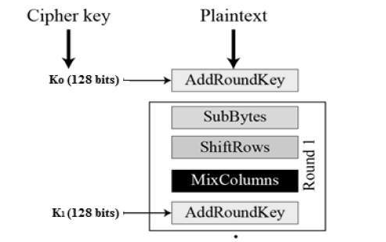
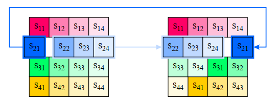
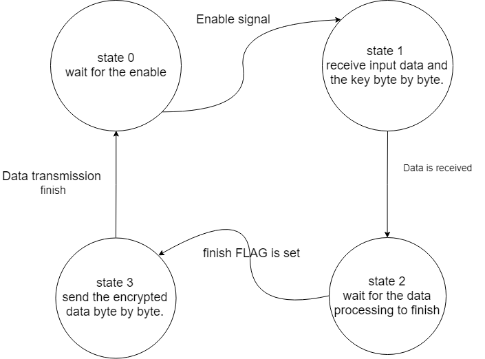
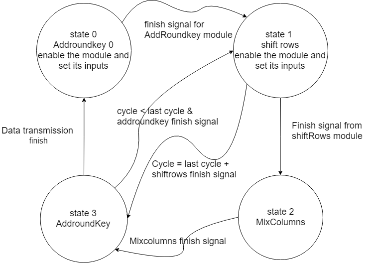
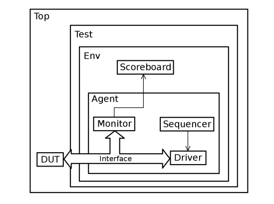

# AES
ADVANCED ENCRYPTION STANDARD [128-BIT CTR MODE].

A specification for the encryption of electronic data established by the U.S. National Institute of Standards and Technology (NIST) in 2001.

## Design
### OVERVIEW
The Encryption process consists of different steps after taking the plaintext and the encryption key as an input it expands the key to 10 different keys and runs the plaintext through cycles of 4 functions to produce the final cipher.
The plaintext is arranged in a 4x4 matrix column wise called state matrix, while the key is arranged in a 4x4 matrix row wise called key matrix. 
The main functions of the process are: Key Expansion, Add Round Key, substitute Bytes, Shift Rows and Mix Columns. 
Every function is a Verilog synthesizable module connected together through a FSM.

### INPUTS AND OUTPUTS
For the Encryption device we have five inputs and three outputs as follows:
#### Inputs 
- Enable: A 1 bit signal received to enable the encryption operation.
- Reset: A 1 bit reset signal that forces Asynchronous reset.
- State_byte: 8 bits signal contains the cipher data received byte by byte every cycle.
- Key_byte: 8 bits signal contains the key received byte by byte every cycle.
Outputs 
- Load:  A 1 bit signal that indicates data is being received by the deivce.
- Ready: A 1 bit signal that indicates that the encryption process is finished and data is ready at the output.
- State_byte_out: 8 bits signal contains the encrypted data sent byte by byte every cycle.
### SUB BYTES
Each byte is replaced by a byte from the previously generated S-Box.
### KEY EXPANSION
The key expansion function takes the user supplied 16 bytes long key and utilizes round constant matrix rcon and the substitution table s_box to generate the next key to be used in the next cycle of encryption.
### ADD ROUND KEY
A bitwise xor of the state matrix and the cycle’s round key matrix.
### SHIFT ROWS
Each row is rotated to the left. The second row is rotated once, second row twice and third row three times.

### MIX COLUMNS 
In this step we compute the new state matrix by left-multiplying the current state matrix by the polynomial matrix P.
### CONNECTING ALL TOGETHER [TOP MODULE]
So to connect all together in the Encryption process, in which every module is instantiated with its inputs and outputs, a certain register for state input and another one for state output, the enable signal is driven by an enable register different from other modules, and the done signal is connected to a wire which then manages the state in the processing FSMs

Two FSMs - Finite State machines- were created to make all this happen.
The first FSM manages the inputs and outputs of the whole device, it first waits for the enable signal to arrive then go to the next state of receiving the cipher data and the key byte by byte every cycle, then it turns to the next state, the processing state which waits for the other FSM to send a finish flag, After the finish flag is set it then turn to the last state in which it sets the ready signal then sends the output encrypted text byte by byte.

The second FSM is the processing FSM, it waits for the data loading to finish then it starts the first step of the encryption, every step/operation is a FSM state, when the operation is due it sets the enable signal of the module then waits for the done signal to move to the next state and so on, till it finishes the cycles of the encryption, after that it sets the finish flag and moves to the starting state, state0.

## Test Bench
### OVERVIEW
Tests were made to trace the data flow, check the synchronization of the system and determine the time of the whole process.
### PROCESS
After instantiating the top module, a clock is generated and set as an input to the module, then we wait for 1 time unit, calling a reset function, after 5 time units it sets the reset signal to zero then trigger a reset done event. 

After the reset done event is triggered the enable signal is set, then the testing inputs – state and key – are sent to the module byte by byte every positive clock edge of the cycle.

After that we wait for a number of cycles then stop the test.
Using Modelsim software we analyze the inputs and the outputs of every process’ step, and compare them with the expected values.

## UVM
### INTRODUCTION
The Universal Verification Methodology (UVM) is a standardized methodology for verifying integrated circuit designs. UVM is derived mainly from the OVM (Open Verification Methodology) which was, to a large part, based on the eRM (e Reuse Methodology) for the e Verification Language developed by Verisity Design in 2001.
### OVERVIEW
A system Verilog Class was create to estimate the output value of the DUT, it takes the inputs – state and key – of the DUT and produce an expected output to be compared with the DUT’s output.
### PROCESS
The main DUT is instantiated inside the UVM tb top module and connected to the UVM’s interface. 

The driver then – Using a FSM - asks the sequencer to generate random inputs and it sends them to the DUT through the interface, then it waits for the ready signal after it finishes, the driver requests another random values. 

In the Monitor there are two class, one for the output and the other one for predicting it. The first one waits for the ready signal, and it then gets the output of the DUT using the interface and stores it in a transaction class object.

The other one get the input that goes to the DUT through the interface and it sends the inputs to the prediction class, and saves its output in a transaction class object.
In the scoreboard a compare function is called upon getting the outputs and it compares them, then display the test state – success or fail - . 

### AES SEQUENCER
A uvm transaction class is created that holds the arbitrar values of the inputs and outputs and the enable, reset signals, these values are set as random values that gets generated and sent to the driver every new sequence in the uvm sequencer class.
### AES DRIVER
The driver class consists mainly of a FSM that drives the input signals and requests a new random values from the sequencer every time it finishes its current process.

The FSM first starts with requesting a new values at the first state, then it sends the state and the key byte by byte in the second state, then waits for the ready signal, then waits for the output signal to be sent, finally it returns to the first state and repeat the cycle.
### AES MONITOR
The monitor consists of two classes, one for the DUT called monitor before, and the other for the prediction class called monitor after.

The first one –monitor before- waits for the ready signal then stores the output encrypted data from the DUT in a transaction object, then this monitor is send through the analysis port to the subscribers - scoreboard-. 

The other one –monitor after- waits for the enable signal to start getting the inputs from the interface, it then stores it in another transaction object, and sends it to the prediction class, which in turn sends the predicted output, which is send through the analysis port to the subscribers - scoreboard-. 
### AES SCOREBOARD
The scoreboard is a class that contains the checkers and verifies that the DUT is working as wanted, it takes the monitors’ outputs through the analysis port, and compare them, then sends the results using the uvm_info macro. 
### DO FILE
The `run.do` file automates the simulation process, it first compiles all the Verilog files, then compiles uvm related file, finally it runs the simulation with certain parameters including the test name.

